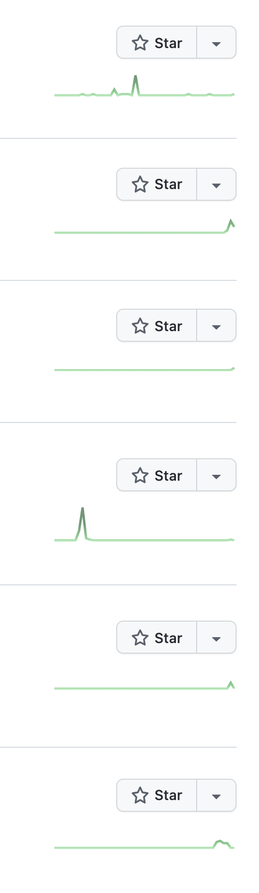

# 혼자 코딩 vs 회사 코딩

학생일 때와 개발자가 되어 회사에 다닐 때 체감되는 차이점이 뭐냐고 한다면

나는 수많은 사이드 이펙트를 고민하게 되는 것라고 할 것이다.

## 혼자 코딩

우리는 보통 공부할 때, 여러가지 언어와 프레임워크를 배운 후

[New Project] 버튼을 누르고 시작한다.

그렇게 코딩을 열심히 하다가

버그가 터지면 다시 돌아본 내 코드는 엉망이지만

문제가 해결될 때까지 추측되는 부분들을 들쑤셔보다가

어느정도 고쳐지면 완성했다는 뿌듯함을 가지고

다시 새 프로젝트을 만들러 떠난다.

<del>다 죽어가는 내 프로젝트의 생명선..</del>

## 회사 코딩

